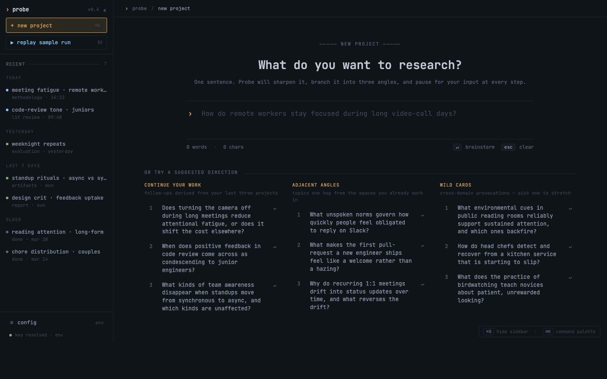

<p align="center">
  
</p>

> **A rehearsal stage for HCI study design.** Type a research premise. Probe walks it through seven Claude-driven stages — interrogator → literature → methodology → artifacts → simulated evaluation → report → simulated peer review — and walks out with a sharpened study, draftable artifacts, and a panel of three reviewers who genuinely disagree about whether the study should exist. Then **Opus 4.7** audits the disagreement and tells you which conflicts the area chair must NOT average away.
>
> *Rehearsal stage for research. The performance still needs humans.*

Built solo for the [Cerebral Valley **Built with Opus 4.7** hackathon](https://cerebralvalley.ai/e/built-with-4-7-hackathon), April 21–26 2026.

---

## Try it in 30 seconds

```bash
git clone https://github.com/Apolotary/probe-researcher.git
cd probe-researcher && npm install && npm run build
npx probe ui --web                # opens http://127.0.0.1:4470/ui
```

Click **`▶ replay sample run`** in the left sidebar → walk a 14-second demo of the full seven-stage pipeline — **no API key required, $0 spend**. Every cached payload was produced by a real Anthropic call; replay is a deterministic re-run with a small synthetic delay so stage transitions stay watchable.

| Path | What you see | API spend |
|---|---|---|
| **`▶ replay sample run`** | The full bundled `focus-rituals` walkthrough — 9 stages, 3 reviewers disagreeing across `RR / ARR / RRX`, Opus disagreement audit | **$0** |
| Type a one-sentence premise → ↵ | Real run with live Opus 4.7 + Sonnet 4.6 calls in [mixed mode](#why-opus-47-matters) | **~$0.30** |

<p align="center">
  
</p>

---

## Why Opus 4.7 matters

The hackathon is about *creative use of Opus 4.7*. Probe routes Opus to the four stages where long-context judgment and role separation matter most. Sonnet 4.6 handles the execution stages. Default `mode = 'mixed'`:

| Stage | Model | What Opus is doing |
|---|---|---|
| **brainstorm** | `claude-opus-4-7` | Splits the premise into three sub-RQs — different angles on one study, not three studies |
| **methodology** | `claude-opus-4-7` | Three integrated study designs that *differ* on arc, method family, and RQ coverage matrix |
| **review** | `claude-opus-4-7` | Three reviewers parameterised by `field × affiliation × topicConfidence` — recommendations spread across `RR / ARR / RRX`, objections substantively different |
| **disagreement audit** *(v2)* | `claude-opus-4-7` | Opus-only meta-meta-review: forced-contrast schema with `realDisagreements`, `falseDisagreements`, and "do not average because" reasoning |

### From the bundled `focus-rituals` demo — three reviewers, real disagreement

> *Premise: How do remote workers stay focused during long video-call days?*

| Reviewer | Profile | Recommendation | Core objection |
|---|---|---|---|
| **R1** | attention & cognitive ergonomics · academic · expert | `RR` | Compelling premise undermined by **crossover contamination** and unverified effect-size claims |
| **R2** | remote work & organizational behavior · CSCW · industry · confident | `ARR` | Strong real-world relevance; minor methodological fixes would make this publishable quickly |
| **R3** | cognitive neuroscience & psychophysiology · academic · expert | `RRX` | The **mechanistic claims fundamentally outrun the measurement apparatus** deployed |
| **AC** | meta-review | `major revisions` | The panel is divided but converges. R2 sees ecological validity; R1 and R3 see structural problems. |

**Then the Opus Disagreement Auditor runs over those three reviewers** and produces a structured analysis identifying:

- **3 real disagreements** the AC must not average away (axes: `contribution`, `validity`, `methodology`)
- **2 apparent disagreements** that look different but are the same objection in different language
- The methodologically strongest reviewer
- An AC decision with `requiredRevisions` items

The forced-contrast schema is the difference between this and a generic "summarise the panel" prompt — the model is *required* to name disagreement and explain why it shouldn't be smoothed.

### Boolean RQ composition (v2) — adapted from Textoshop

When two sub-RQs are selected on the brainstorm stage, three buttons appear: **`∪ merge`**, **`∩ shared`**, **`− subtract`**. Opus composes a fresh sub-RQ from the two parents, with a `rationale` field that has to explain what the composition adds vs. picking either parent alone. (Pattern adapted from Textoshop, [arxiv 2409.17088](https://arxiv.org/abs/2409.17088).)

---

## Built during the hackathon (April 21–26 2026)

The submitted artifact is the **interactive web/TUI workflow** + the **live Anthropic web pipeline** + the **v2 Opus features**. Specifically:

- `src/cli/ui_app.tsx`, `src/cli/ui_scenes/`, `src/cli/ui_state.ts` — TUI router + scenes + workflow state
- `src/llm/probe_calls.ts` — async fns hitting the Anthropic SDK directly. **v2 additions:** `disagreementAudit`, `rqBoolean`
- `src/web/server.ts`, `src/web/probe_api.ts` — Express server + `/api/probe/<stage>` endpoints. **v2 additions:** rate limits (30 req/min/IP), provenance guard for report/findings/review payloads, `/api/probe/models` for per-stage routing, `/api/probe/config` for live TOML round-trip
- `src/web/probe_design/` — the design-handoff JSX + HTML. **v2 additions:** Opus-amber model badges, boolean-ops UI on brainstorm, replay-active pill, real recents from disk
- `src/web/probe_demo.ts` + `assets/demos/focus-rituals.json` — save/replay infrastructure with the bundled gold demo (62KB, 9 stages, 3 reviewers, audit)
- `src/config/probe_toml.ts` — atomic config layer with per-stage model resolver

**Pre-existing (engine the new UI sits on, not part of the submission scope):**

- `src/anthropic/client.ts`, `src/lint/`, `src/orchestrator/`, `src/render/` — the older offline pipeline behind `probe run`
- `runs/` — 19 benchmark research runs documenting how Probe behaves at scale (kept as rigor reference)
- `corpus/source_cards/`, `patterns/`, `agents/<role>.md` — the 12-source-card corpus, 16-pattern capture-risk library, agent prompts

---

## Honesty machinery

Probe **does not produce evidence**. It produces a study plan and a rehearsal of what could go wrong.

- Every simulated output carries `[SIMULATION_REHEARSAL]`
- The provenance linter (offline, `probe lint`) refuses to ship guidebooks where simulated content uses evidence language (`findings show`, `users preferred`, `statistically significant`, etc.)
- v2 closes the gap on the web side: `served()` runs the same forbidden-phrase scan against `report` / `findings` / `review` JSON before shipping. Hits get tagged inline with `[⚠ SIMULATED · do not cite]` and surfaced in `provenance.violations`
- The replay system is a deterministic re-run of cached LLM responses. Every cached payload includes `modelMode` metadata. A cyan **`● replay · focus-rituals ×`** pill in the top-right of every stage marks all responses as cached, not live
- The web UI requires an Anthropic key to run live (the new `probe_calls.ts` is Anthropic-only). `/api/probe/status` exposes `canRunLiveUi: true` only when a key resolves — no false positives. Frontend stock fallback handles the 500 cleanly

---

## Claims → where to verify

| Claim | Verify by |
|---|---|
| Opus 4.7 powers brainstorm / methodology / review / disagreement audit | `GET /api/probe/models` (returns the resolved per-stage model); amber badge in each stage's spinner |
| Replay is cached, not live | Cyan `● replay · …` pill on every stage; `assets/demos/focus-rituals.json` includes `modelMode: 'mixed'` and full payloads |
| Three reviewers genuinely disagree | `assets/demos/focus-rituals.json` → `state.reviewSession.reviewers` (R1=RR, R2=ARR, R3=RRX with substantively different objections) |
| Opus disagreement audit is forced-contrast | `assets/demos/focus-rituals.json` → `state.disagreementAudit` (3 real, 2 apparent, named "do not average" rationale per axis) |
| Web outputs are guarded against evidence language | `src/web/probe_api.ts` `STAGES_TO_GUARD`; `src/lint/forbidden.ts` regex set |
| Config is real, not mock | `/ui/config`; `~/.config/probe/probe.toml` (atomic write, `0600` perms) |
| Recents are from disk | Sidebar hydrates from `/api/probe/demo/list` |
| No hackathon-rules confusion | This README's "Built during the hackathon" section + `CLAUDE.md` |

---

## Try it live

```bash
export ANTHROPIC_API_KEY=sk-ant-...
npx probe ui --web
```

Or set the key via the in-app config screen at `/ui/config` — persisted to `~/.config/probe/probe.toml` with `0600` perms.

```bash
npm test                          # 97 / 97
npx probe doctor --once           # 13 / 13 checks, "demo-ready"
```

---

## The pre-existing offline pipeline (`probe run`)

For batch / CI / multi-branch use, the older offline CLI still ships:

```bash
probe run "design a screen-reader-aware checkout flow for BLV users"
```

Spawns three real git worktrees — three divergent research programs — and runs each through an 8-stage pipeline producing `PROBE_GUIDEBOOK.md` per surviving branch. Documented in [`CLAUDE.md`](./CLAUDE.md). Three named benchmark runs ship under `runs/`: `demo_run` (BLV screen-reader + AI news), `benchmark_code_review` (LLM code review), `benchmark_creativity_support` (poets). Each has a `PROBE_REPORT.pdf` you can open to see what a finished guidebook looks like.

---

## 200-word summary

> Probe is a rehearsal stage for HCI study design. A researcher types a premise — *"How do remote workers stay focused during long video-call days?"* — and a Claude-driven pipeline walks it through seven stages: an interrogator that sharpens it into three sub-research-questions, a literature agent that surfaces gaps per RQ, a methodologist that proposes integrated study designs, an artifact agent that drafts implementation plan + IRB memo + validation protocol, a simulated pilot that surfaces friction, a report drafter that produces Discussion + Conclusion + arXiv-ready LaTeX, and an ARR-style peer-review panel where three reviewers parameterised by `field × affiliation × topicConfidence` genuinely disagree across recommendation buckets (`RR / ARR / RRX`). **An Opus 4.7-only Disagreement Auditor** then runs over the panel with a forced-contrast schema and identifies which conflicts the area chair must not average away. Default mode is `mixed` — Opus 4.7 on the four orchestration stages, Sonnet 4.6 on execution. **Save once, replay forever**: a $0.30 live walk can be saved and replayed in 14 seconds with $0 spend, so demos don't burn credits. Every simulated output is `[SIMULATION_REHEARSAL]`-tagged; a forbidden-phrase guard refuses to let web outputs claim evidence.

---

## Limitations

**Probe does not replace real user research.** It triages design directions before participants are ever recruited.

- **Simulation is rehearsal, not evidence.** Every walkthrough is a structured guess. The linter fails the build if any of them use evidence language.
- **Single-author, single-domain corpus.** 12 hand-curated source cards, biased toward HCI methodology canon. Reviewers outside HCI may find the agent voice plausible but not verifiable from their own field.
- **No empirical evaluation.** The bet that Probe saves PhD students months is unvalidated; the project ships before any researcher has used it for a real study. Next step is a controlled study with PhD cohorts.
- **Anthropic-only live web.** The new web UI requires an Anthropic key for live calls; OpenAI fallback exists in the older offline pipeline but is deliberately disabled for the web path. Replay works without any key.
- **Project page is templated.** `/ui/project` shows a coherent project-management view bound to a sample run. Labeled "view sample project page" to be honest about it.

---

## Closest HCI neighbors

Probe sits inside an active CHI 2026 conversation about LLMs as collaborators in research workflows. The three closest neighbors and how Probe differs:

- **[Perspectra](https://arxiv.org/abs/2509.20553)** (Choosing Your Experts Enhances Critical Thinking in Multi-Agent Research Ideation) — multi-agent expert perspectives for *ideation*. Probe takes the same multi-agent expert primitive but points it at **adversarial venue-style review** of a complete study plan, with a forced-contrast disagreement audit on top.
- **[Peeking Ahead of the Field Study](https://arxiv.org/abs/2602.16157)** (VLM personas for embodied HCI studies) — synthetic personas as **formative preparation**, not substitutes for participants. Probe inherits the same epistemic boundary verbatim: simulated outputs are tagged `[SIMULATION_REHEARSAL]` and a forbidden-phrase guard refuses to let them claim evidence. The framing throughout this README — *preflight method*, *rehearsal not evidence* — is downstream of this paper's positioning.
- **[Cocoa](https://arxiv.org/abs/2412.10999)** (Co-Planning and Co-Execution with AI Agents) — agents as **co-planners** in a shared research-design artifact, not chat assistants. Probe's seven-stage workflow is co-planning infrastructure: every stage's output is editable and feeds the next.

Two additional papers shaped specific design choices:

- **[Just-in-Time Objectives](https://arxiv.org/abs/2510.14591)** — argues LLM systems improve when each interaction has a specialized in-the-moment objective rather than a general-purpose assistant role. Each Probe stage is a separate objective (sharpen the question · find the gap · pick the method · draft the artifacts · simulate friction · write the report · rehearse peer review). The seven-stage structure is exactly this paper's prescription.
- **[The Siren Song of LLMs](https://arxiv.org/abs/2509.10830)** (dark patterns in LLMs) — names the danger of persuasive false confidence in AI-mediated dialogue. Probe's most important risk is exactly this: a simulated peer-review panel that approves a weak study could give a researcher cover to skip a real review. The honesty machinery (provenance tags, forbidden-phrase guard, replay pill, modelMode metadata) is the architectural answer.

For deeper related-work context, see [`RESEARCH_CONTEXT.md`](./RESEARCH_CONTEXT.md).

---

## Citing this work

```bibtex
@article{ryskeldiev2026probe,
  title   = {Probe: Rehearsal-Stage Triage for Screen-Based Interactive Research},
  author  = {Ryskeldiev, Bektur},
  year    = {2026},
  journal = {arXiv preprint},
  note    = {Built at the Cerebral Valley Claude Opus 4.7 hackathon}
}
```

A machine-readable citation lives in [`CITATION.cff`](./CITATION.cff). License: Apache 2.0 — see [`LICENSE`](./LICENSE) and [`NOTICE`](./NOTICE). Architecture deep-dive: [`CLAUDE.md`](./CLAUDE.md).

## Author

Bektur Ryskeldiev — HCI / accessibility research.
