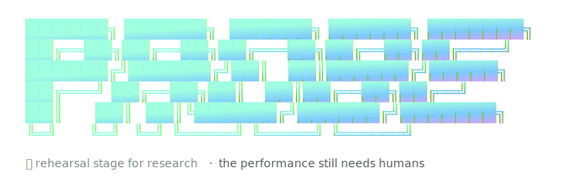

<p align="center">
  
</p>

# Probe

**A rehearsal stage for HCI study design.** Type a research premise, watch Claude Opus 4.7 walk it through a seven-stage pipeline — interrogator → literature → methodology → artifacts → simulated evaluation → report → simulated peer review — and walk out with a sharpened study, draftable artifacts, and a panel of three reviewers who actually disagree.

> *Rehearsal stage for research. The performance still needs humans.*

Built for the [Cerebral Valley **Built with Opus 4.7** hackathon](https://cerebralvalley.ai/e/built-with-4-7-hackathon), April 21–26 2026.

---

## Hackathon submission · 60-second tour

> **Try it now (no install):** `git clone … && cd probe-researcher && npm install && npm run build && export ANTHROPIC_API_KEY=… && npx probe ui --web` then open `http://127.0.0.1:4470/ui`.

> **Try it without an API key:** the same URL ships with a saved demo. Click `▶ replay sample run` in the left sidebar and walk through a 14-second pre-recorded run — no API spend.

What's new in this hackathon (built April 21–26, 2026): everything under `src/cli/ui_app.tsx`, `src/cli/ui_scenes/`, `src/cli/ui_state.ts`, `src/llm/probe_calls.ts`, `src/web/probe_api.ts`, `src/web/probe_design/`, `src/web/probe_demo.ts`, and `src/config/probe_toml.ts` — the new **probe ui** surface (TUI + web shell) and the live Anthropic API integration that drives every stage.

The older offline pipeline (`probe run`, `probe lint`, the provenance linter) is the engine the new UI sits on top of. It existed before the hackathon and is documented further below; nothing about it was changed for the submission.

### What's interesting about it

- **Three reviewers genuinely disagree.** The simulated peer-review panel (1 area chair + 3 reviewers, each parameterised by `field` × `affiliation` × `topic confidence`) routinely lands recommendations spread across `RR / ARR / RRX`. The area-chair meta-review reconciles them. This holds across runs because Opus 4.7 sustains the role-separation under length.
- **Per-stage model selection.** `[models].mode` in `~/.config/probe/probe.toml` flips the whole pipeline between `sonnet` (cheap), `opus` (best), or `mixed` (Opus on orchestration stages — brainstorm/methodology/review — Sonnet on execution). Defaults to sonnet for fast demos.
- **Save once, replay forever.** A real run takes ~2 minutes (9 LLM calls). On the Done page, click `● save as demo` to capture the entire state to `~/.config/probe/demos/<slug>.json`. Click `▶ replay sample run` in the sidebar to walk through it again in ~14 seconds with the same spinners and phase dots — no API spend.
- **Provenance, by force.** Everything synthesized is tagged `[SIMULATION_REHEARSAL]`. The provenance linter (carried over from the offline pipeline) refuses to ship guidebooks where simulated content uses evidence language.

### 200-word submission summary

Probe is a rehearsal stage for HCI study design. An HCI PhD student types one sentence — *"How do remote workers stay focused during long video-call days?"* — and Probe walks the premise through seven stages with Claude Opus 4.7: an interrogator that sharpens it into three sub-research-questions, a literature agent that surfaces gaps per RQ, a methodologist that proposes integrated study designs (one paper, layered methods, RQ-coverage matrix), an artifact agent that drafts the implementation plan + validation protocol + IRB memo, a simulated pilot that surfaces friction with N synthetic participants, a report drafter that produces Discussion + Conclusion + arXiv-ready LaTeX, and — the wow moment — a simulated peer-review panel where three reviewers from different fields *disagree*, and an area chair writes a meta-review reconciling them. Every stage is live-callable through Anthropic's SDK; every output is tagged `[SIMULATION_REHEARSAL]`; every run can be saved and replayed in 14 seconds for demos. Built during the hackathon: the full `probe ui` web shell + TUI + live API integration. The bet is that PhD students get six months back to spend on the study that survives the rehearsal.

---

---

## What it does

You type:

```bash
probe run "design a screen-reader-aware checkout flow for BLV users"
```

Probe spawns three git worktrees — three divergent research programs — and runs each through an 8-stage pipeline:

1. **Premise interrogation** — a senior-PI voice pushes back on the premise
2. **Solution ideation** — three branches that differ on research question, intervention primitive, human-system relationship, and method family
3. **Literature grounding** — constrained to a hand-curated corpus (no hallucinated citations)
4. **Prototype specification** — a Wizard-of-Oz spec another researcher could build from
5. **Simulated walkthrough** — a structured rehearsal, tagged `[SIMULATION_REHEARSAL]` (not evidence)
6. **Capture-risk audit** — 16 named patterns across Capacity / Agency / Exit / Legibility, firing against quoted evidence spans
7. **Adversarial review** — methodologist, accessibility advocate, (optionally) novelty hawk, and meta-reviewer
8. **Guidebook assembly** — a six-section study guidebook where every paragraph, bullet, and table row carries a provenance tag

Surviving branches produce `PROBE_GUIDEBOOK.md`. Blocked branches produce `WORKSHOP_NOT_RECOMMENDED.md`.

A provenance linter fails the build if any element is unlabeled or if a `[SIMULATION_REHEARSAL]` element uses evidence language.

## Install

### Prerequisites

| Tool | Version | Needed for |
|---|---|---|
| **Node.js** | 20 LTS or newer | everything |
| **git** | 2.40+ | the real-git-worktree branching pattern |
| **Anthropic API key** | with access to `claude-opus-4-7` and `claude-sonnet-4-6` | `probe run`, `probe import`, `probe audit-deep`, etc. |
| pandoc + wkhtmltopdf | *optional* | `probe render` and `probe build-paper` PDF output |

On macOS with Homebrew:

```bash
brew install node@20 git pandoc wkhtmltopdf
```

On Debian/Ubuntu:

```bash
sudo apt install nodejs git pandoc wkhtmltopdf
# If your distro's node is older than 20, use NodeSource:
#   curl -fsSL https://deb.nodesource.com/setup_20.x | sudo bash -
```

### Setup

```bash
git clone https://github.com/Apolotary/probe-researcher.git
cd probe-researcher

npm install          # installs TypeScript, Ink, remark, Ajv, Anthropic SDK, etc.
npm run build        # compiles src/ to dist/

export ANTHROPIC_API_KEY="sk-ant-..."        # add to ~/.zshrc or ~/.bashrc for persistence
```

### Validate the install

```bash
npx probe doctor
```

Expected: **10/11 green** checks (typecheck, tests, linters on shipped guidebooks, pandoc/wkhtmltopdf availability, git cleanliness, corpus/pattern/benchmark inventory, paper PDF). A 1-check warning for uncommitted changes is normal. If anything fails, the rest of the tour won't work.

Two more no-API-cost commands confirm the infrastructure is wired up:

```bash
npx probe lint runs/demo_run/PROBE_GUIDEBOOK.md   # the load-bearing provenance linter on a shipped guidebook
npx probe stats --all                             # cross-run dashboard; writes RUNS_SUMMARY.md at repo root
```

### First real run

Easiest — just run `probe` with no arguments to get an interactive menu:

```bash
npx probe
```

The menu adapts to your keys (run a new premise, import a paper, explore existing runs, dashboard, doctor). With no API keys set, Probe enters **demo mode** — the offline commands (browse, render, lint, stats) stay available against shipped runs.

Or use the direct subcommands:

```bash
# Cold-start: one sentence of research intent (~25 min, ~$6)
npx probe run "your research premise here"

# Warm-start: an in-progress paper draft (~1 min, ~$0.10)
npx probe import path/to/your/paper.md
npx probe run --run-id <the-import-id> --skip 1,2,3,4,5 "<premise sentence>"
```

### Everything else

```bash
# Interactive surfaces (new — designed in Claude Design)
npx probe ui                            # full TUI workflow: premise → 7-stage walkthrough → done
npx probe ui --web                      # same flow in a browser at /ui (full Dossier prototype)

# Inspect
npx probe runs                          # Linear-style list of every run under runs/
npx probe stats <run_id>                # per-run triage: verdicts, axis fires, lint, anomalies
npx probe gantt <run_id>                # per-run stage × branch timeline
npx probe replay <run_id>               # deterministic artifact replay (no API calls)

# Render
npx probe render <run_id>               # PDF/HTML/markdown bundle of the run
npx probe panel <run_id> <branch>       # reviewer-disagreement HTML panel
npx probe build-paper                   # build paper/probe.{html,pdf}

# Managed Agents features
npx probe explore <run_id>              # Ink 3-pane worktree-style UI
npx probe audit-deep <run_id> <branch>  # tool-equipped deep audit (bash / grep / file ops)
npx probe interview <run_id>            # simulated participant interview
npx probe symposium <run_id>...         # multi-run convener report
```

### `probe ui` — interactive workflow (TUI + web)

`probe ui` opens a stateful 7-stage workflow with a LazyVim-style launcher and live Anthropic API calls:

```
launcher → premise → brainstorm 3 RQs → literature → methodology
        → artifacts → evaluation → report → review (1AC + 3 reviewers) → done
```

Both surfaces share state via `~/.config/probe/probe.toml` and call the same `/api/probe/*` endpoints (mounted on the express server when `--web` is passed). Without an API key, every stage falls back to canned content so the demo still runs.

```bash
# TUI (default)
probe ui

# Browser companion — same flow, richer chrome
probe ui --web

# Jump to a specific scene (development)
probe ui --scene methodology
```

The review stage (07) runs an ARR-style peer-review pass — one area chair plus three reviewers, each with their own `field`, `affiliation` (academic / industry / independent), and `topicConfidence` (expert / confident / tentative / outsider). Reviewers disagree by design and the AC writes a meta-review with consensus points tagged `all-3` / `2-of-3` / `1-of-3`.

### Providers and keys

Probe prefers Anthropic's Claude models — the paper's capability claims were measured there. With only an OpenAI key it falls back to OpenAI; with neither it enters a read-only demo mode:

| State | Behavior |
|---|---|
| `ANTHROPIC_API_KEY` set | Primary. Opus 4.7 for judgment stages, Sonnet 4.6 for retrieval/templating. |
| Only `OPENAI_API_KEY` set | Fallback. `gpt-5` stands in for Opus-tier calls; `gpt-4.1-mini` for Sonnet-tier. Override with `PROBE_OPENAI_OPUS_MODEL` / `PROBE_OPENAI_SONNET_MODEL`. The paper's Opus-specific capability claims do not carry over — the pipeline still runs, but the comparative findings become Anthropic-specific footnotes rather than live claims. |
| No keys | Demo mode. Offline-only commands (`probe runs`, `probe stats`, `probe explore`, `probe lint`, `probe render`, `probe report-page`, `probe doctor`) all still work against shipped runs. |
| `PROBE_PROVIDER=<name>` | Force `anthropic` / `openai` / `demo` regardless of key detection. |

### Environment knobs (all optional)

| Variable | Effect |
|---|---|
| `ANTHROPIC_API_KEY` | preferred provider |
| `OPENAI_API_KEY` | fallback provider |
| `PROBE_PROVIDER` | force `anthropic` / `openai` / `demo` |
| `PROBE_FORCE_SONNET=1` | collapse all Opus-tier calls to Sonnet-tier (~2.4× cheaper on Anthropic) |
| `PROBE_OPUS_MODEL` / `PROBE_SONNET_MODEL` | Anthropic model overrides (default: `claude-opus-4-7` / `claude-sonnet-4-6`) |
| `PROBE_OPENAI_OPUS_MODEL` / `PROBE_OPENAI_SONNET_MODEL` | OpenAI model overrides (default: `gpt-5` / `gpt-4.1-mini`) |
| `PROBE_OPENAI_OPUS_USD_IN` / `PROBE_OPENAI_OPUS_USD_OUT` / same for sonnet | OpenAI pricing overrides per MTok |
| `PROBE_NO_BANNER=1` | suppress the ASCII logo (narrow terminals, CI logs) |

### No LaTeX required

`probe build-paper` uses pandoc + wkhtmltopdf to produce `paper/probe.pdf`. For camera-ready LaTeX, the `paper_acm/` subdirectory ships an ACM `sigconf` (double-column) version — upload `probe_acm_sigconf.zip` (in repo root) via Overleaf's *New Project → Upload Project*.

A pre-populated `runs/demo_run/` ships with the repo so you can browse a full pipeline without spending any API credit. See [`DEMO_WALKTHROUGH.md`](./DEMO_WALKTHROUGH.md) for a 10-minute tour that uses only shipped artifacts.

## Architecture

```
probe/
├── cli/                 # probe run | runs | gantt | render | lint | audit-deep | interview | symposium | explore
├── agents/              # system prompts, one per stage
├── corpus/source_cards/ # hand-curated literature, verifiable DOIs only
├── patterns/            # 16 capture-risk patterns (4 axes × 4 each)
├── schemas/             # JSON schemas for every stage boundary
├── src/                 # orchestrator, linters, anthropic client
├── benchmarks/          # premise cards for evaluation harness
├── runs/demo_run/       # pre-populated deterministic run
└── demo/                # storyboard, script, recorded run
```

Each branch runs in a real `git worktree` — `git log --graph --all` on a completed run shows the research process as structured commits.

## Model routing

Probe uses Claude **Opus 4.7** for stages that need skeptical judgment, vision, sustained adversarial stance, or long-context synthesis with provenance constraints. Non-critical stages (literature grounding, prototype templating) route to **Sonnet 4.6** to preserve budget. See [`CLAUDE.md`](./CLAUDE.md) for the full routing table.

## Benchmarks

Three benchmark runs ship with the repo, each on a different research domain. `npx probe runs` lists them:

| Run | Domain | Verdict |
|---|---|---|
| `demo_run` | BLV screen-reader + AI-generated news | 1 surviving (branch B), 2 blocked |
| `benchmark_code_review` | AI-assisted code review for engineers | 0 surviving, 2 blocked, 1 infra-failed |
| `benchmark_creativity_support` | creativity-support tool for poets | 1 surviving (branch A), 0 blocked |

The three domains expose different parts of the pattern library. The code-review domain fires `legibility.no_failure_signal` and `legibility.opaque_ranking` heavily; the accessibility domain fires agency and legibility patterns; the creativity-support domain fires almost no capture-risk patterns at all (a useful signal that the pattern library may need a `capacity.narrows_expressive_range` pattern for creative tools — see [`docs/V2_ROADMAP.md`](./docs/V2_ROADMAP.md)).

Each run has a `PROBE_REPORT.pdf` produced by `probe render` that bundles the guidebook, reviewer panel, audit findings, and lint status for offline review. The `benchmarks/` directory has the Opus-vs-Sonnet ablation on the methodologist reviewer (`model_ablation_methodologist.md`) and the hallucination test with a planted fake citation (`hallucination_test.md`).

A benchmark passes only if **citation hygiene + provenance lint + forbidden-phrase lint** all pass. All three shipped runs pass these checks on their surviving branches.

## Limitations

**Probe does not replace real user research.** It triages design directions before participants are ever recruited.

- **Simulation is rehearsal, not evidence.** The walkthroughs are structured guesses about what a user *might* encounter. They are explicitly tagged `[SIMULATION_REHEARSAL]` and the linter fails the build if they use evidence language.
- **Scope: screen-capturable digital interactions.** Out of scope: ethnographic fieldwork, long-term in-the-wild deployment, embodied AR/VR without screen capture, any research without a capturable digital artifact.
- **Vision quality depends on Opus 4.7.** Mode B screenshot walkthrough inherits the model's limitations in interpreting dense UI state.
- **Nothing here is findings.** If a human-facing artifact ever says `users preferred` or `findings show`, the linter failed and the build is broken.

## Research context

See [`RESEARCH_CONTEXT.md`](./RESEARCH_CONTEXT.md) for the theoretical grounding (Sanders & Stappers probes framework, Buijsman et al. autonomy-by-design, Illich's conviviality, Kafer's political/relational model of disability) and full bibliography with verified DOIs.

## Extending

See [`CLAUDE.md`](./CLAUDE.md) for:
- Commit discipline (`stage-N [branch-X]: <summary>`)
- How to add source cards, capture-risk patterns, agent prompts
- The non-negotiable commitments

## Citing this work

If you use Probe in research, teaching, derivative software, or a paper, **please cite it**. This is the one thing the author asks in exchange for open-sourcing the code.

The preferred citation is the arXiv paper that documents the system in depth:

```bibtex
@article{ryskeldiev2026probe,
  title   = {Probe: Rehearsal-Stage Triage for Screen-Based Interactive Research},
  author  = {Ryskeldiev, Bektur},
  year    = {2026},
  journal = {arXiv preprint},
  note    = {Built at the Cerebral Valley Claude Opus 4.7 hackathon}
}
```

A machine-readable citation is available in [`CITATION.cff`](./CITATION.cff) — GitHub will render a "Cite this repository" button from it automatically.

If you modify Probe and ship a derivative, the Apache 2.0 license already requires you to (1) include the [`LICENSE`](./LICENSE) file, (2) preserve the [`NOTICE`](./NOTICE) file and its contents in any derivative works, and (3) state prominent changes. See the [Apache 2.0 attribution terms](https://www.apache.org/licenses/LICENSE-2.0#redistribution). The CITATION.cff file makes the additional expectation explicit: if you publish or demo the derivative, cite the paper.

## License

Apache 2.0 — see [`LICENSE`](./LICENSE) and [`NOTICE`](./NOTICE). Attribution is required under the license terms; see the [Citing this work](#citing-this-work) section above for the preferred citation.

## Author

Bektur Ryskeldiev — HCI / accessibility research.
