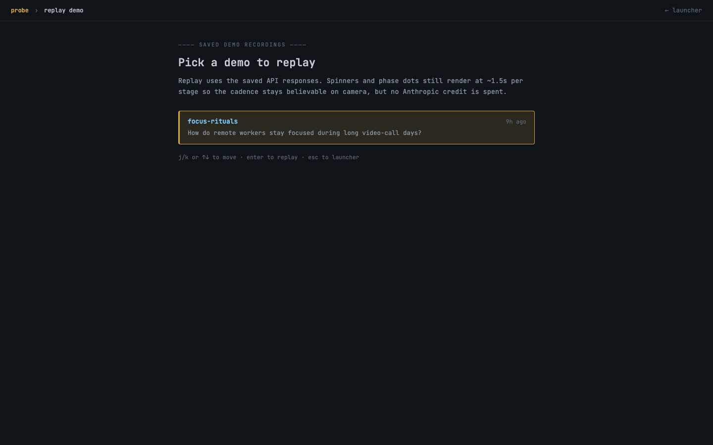
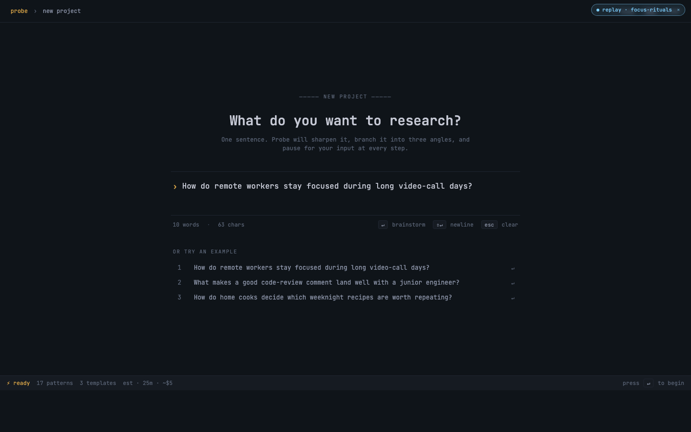
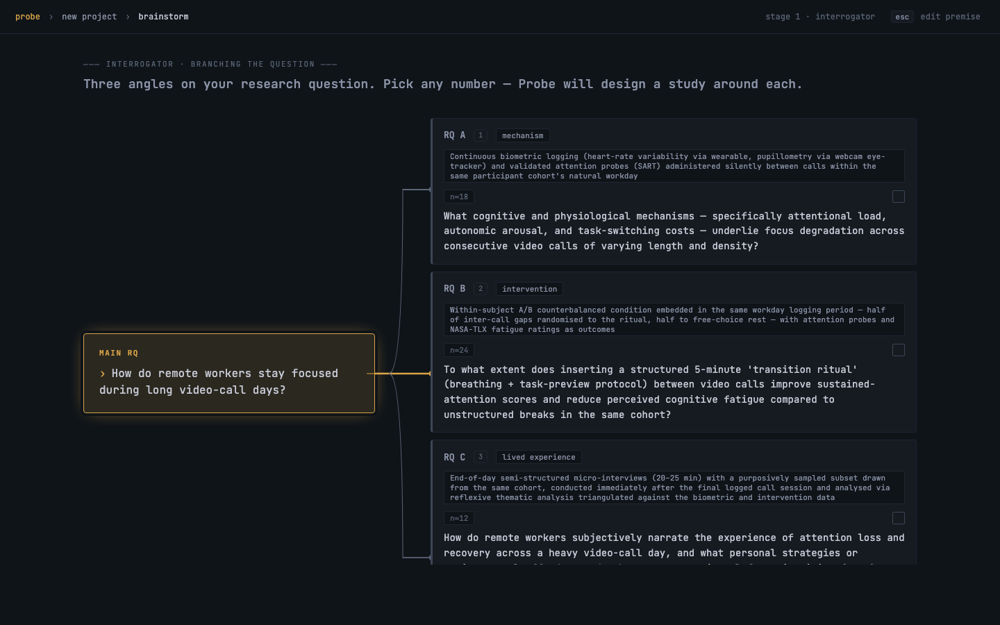

<p align="center">
  
</p>

> **A rehearsal stage for HCI study design.** Type a research premise. Watch Claude Opus 4.7 walk it through a seven-stage pipeline — interrogator → literature → methodology → artifacts → simulated evaluation → report → simulated peer review — and walk out with a sharpened study, draftable artifacts, and a panel of three reviewers who actually disagree.
>
> *Rehearsal stage for research. The performance still needs humans.*

Built for the [Cerebral Valley **Built with Opus 4.7** hackathon](https://cerebralvalley.ai/e/built-with-4-7-hackathon), April 21–26 2026.

---

## Try it now

Two paths in:

```bash
git clone https://github.com/Apolotary/probe-researcher.git
cd probe-researcher && npm install && npm run build
export ANTHROPIC_API_KEY=…   # optional — bundled demo runs without one
npx probe ui --web           # opens http://127.0.0.1:4470/ui
```

| Path | What you get | API spend |
|---|---|---|
| **`▶ replay sample run`** in the sidebar | a 14-second walkthrough of a saved run (focus-rituals, 9 stages, 3 reviewers disagreeing) | **$0** |
| Type a one-sentence premise → Enter | a real ~2-minute run with live Opus 4.7 + Sonnet 4.6 calls | ~$0.50 |

<p align="center">
  
  <br/>
  <em>The shell. Sidebar with replay button + recents · hero input · three columns of suggested directions.</em>
</p>

---

## The web UI is the demo

Everything in the submission is one browser tab. The shell at `/ui` mounts the new-project flow as an iframe so the sidebar (recents, replay, config) stays visible while you walk the seven stages.

### Two ways to start a study

After typing a premise you have two options:

- **`↵ brainstorm`** — the standard flow. The interrogator agent splits your premise into three sub-research-questions (different angles on the same study) and you pick which to pursue.
- **`⌘↵ skip · use as-is`** — if your question is already sharp. Wraps the premise as RQ A and jumps straight to literature. No three-way branching.

### `▶ replay sample run` — the no-API-key path judges actually click

Sidebar → demo picker → pre-recorded run. The right side is canned but every spinner and phase-dot still fires, so the cadence stays believable on camera.

<p align="center">
  
</p>

While replay is active, a small **`● replay · focus-rituals ×`** pill sits in the top-right of every stage so the user always knows the responses are cached. Click the pill to exit replay and return home.

<p align="center">
  
</p>

### Walking the seven stages

`brainstorm → literature → methodology → artifacts → evaluation → report → review`. Each stage has a model spinner, a phase-dot strip, breadcrumb back-jumps, and an editable result. Brainstorm shows three RQs as facets of one integrated study (not three separate studies — that's the methodology-stage move):

<p align="center">
  
</p>

The review stage is the centerpiece: 1 area chair + 3 reviewers, each parameterised by `field × affiliation (academic | industry | independent) × topicConfidence (expert | confident | tentative | outsider)`. They land on different recommendation buckets (`A | ARR | RR | RRX | X`) and the area chair writes a meta-review reconciling them.

---

## What's interesting about it

- **Three reviewers genuinely disagree.** The simulated peer-review panel routinely lands recommendations spread across `RR / ARR / RRX`. The area-chair meta-review reconciles them. This holds across runs because Opus 4.7 sustains role-separation under length.
- **Per-stage model selection.** `[models].mode` in `~/.config/probe/probe.toml` flips the whole pipeline between `sonnet` (cheap), `opus` (best), or `mixed` (Opus on orchestration — brainstorm/methodology/review — Sonnet on execution).
- **Save once, replay forever.** A real run takes ~2 minutes. On the Done page, click `● save as demo` to capture the entire state to `~/.config/probe/demos/<slug>.json`. Replay walks through it in ~14 seconds with the same spinners — no API spend.
- **Provenance, by force (offline pipeline).** `probe run` outputs go through a provenance linter that refuses to ship guidebooks where `[SIMULATION_REHEARSAL]` content uses evidence language. The web UI labels its simulated pilot/findings as rehearsal in the rendered text and exports, but does not run the linter against the live JSON it generates — treat web-stage outputs as scaffolding, not evidence.
- **Graceful keyless replay.** Stages whose slice isn't cached AND whose live LLM call fails fall back to a shaped-but-empty payload. Every stage on the frontend has a stock fallback, so a judge with no key sees zero 500s and zero console errors.
- **Skip-brainstorm path.** Researchers who already have a sharp question can `⌘↵` past the interrogator and run the rest of the pipeline with their premise as the only RQ.

---

## Architecture

The new `probe ui` web surface is everything under:

```
src/cli/ui_app.tsx         # Ink router, scene state (TUI side)
src/cli/ui_scenes/         # one .tsx per stage (TUI)
src/cli/ui_state.ts        # workflow state carried between stages
src/llm/probe_calls.ts     # async fns hitting Anthropic SDK directly
src/web/probe_api.ts       # /api/probe/<stage> Express endpoints
src/web/probe_design/      # the design-handoff JSX + HTML (web shell)
src/web/probe_demo.ts      # demo save/replay (~/.config/probe/demos)
src/config/probe_toml.ts   # ~/.config/probe/probe.toml read/write
```

Pipeline order is fixed: `framing → literature → methodology → artifacts → evaluation → report → review`. Each stage endpoint goes through a `served()` helper that short-circuits to the active demo's saved slice (with synthetic latency) when replay is active, and falls back to a shaped-but-empty payload when both cache and live fail. See [`CLAUDE.md`](./CLAUDE.md) for the full architecture, model-routing table, and contribution guidelines.

### Model routing

Probe uses Claude **Opus 4.7** for stages that need skeptical judgment, vision, sustained adversarial stance, or long-context synthesis with provenance constraints. Non-critical stages route to **Sonnet 4.6** to preserve budget. Default mode is `sonnet` for fast demos; flip to `mixed` or `opus` in `~/.config/probe/probe.toml`.

---

## The pre-existing offline pipeline (`probe run`)

For batch / CI / multi-branch use, the older offline CLI still ships:

```bash
probe run "design a screen-reader-aware checkout flow for BLV users"
```

This spawns three git worktrees — three divergent research programs — and runs each through an 8-stage pipeline that produces a `PROBE_GUIDEBOOK.md` per surviving branch (or a `WORKSHOP_NOT_RECOMMENDED.md` per blocked branch). The provenance linter fails the build if any element is unlabeled or if a `[SIMULATION_REHEARSAL]` element uses evidence language.

The offline pipeline is the engine the new `probe ui` web shell sits on top of. It existed before the hackathon and is not part of the submission scope, but it remains the reference for how Probe is supposed to behave at scale. Three benchmark runs ship under `runs/` — `demo_run`, `benchmark_code_review`, `benchmark_creativity_support` — each with a `PROBE_REPORT.pdf` you can open to see what a finished guidebook looks like.

```bash
npx probe runs              # list shipped + local runs
npx probe lint <file>       # provenance + forbidden-phrase linter
npx probe doctor --once     # pre-demo verification (typecheck, tests, lints, deps)
```

---

## 200-word submission summary

Probe is a rehearsal stage for HCI study design. An HCI PhD student types one sentence — *"How do remote workers stay focused during long video-call days?"* — and Probe walks the premise through seven stages with Claude Opus 4.7: an interrogator that sharpens it into three sub-research-questions, a literature agent that surfaces gaps per RQ, a methodologist that proposes integrated study designs (one paper, layered methods, RQ-coverage matrix), an artifact agent that drafts the implementation plan + validation protocol + IRB memo, a simulated pilot that surfaces friction with N synthetic participants, a report drafter that produces Discussion + Conclusion + arXiv-ready LaTeX, and — the wow moment — a simulated peer-review panel where three reviewers from different fields *disagree*, and an area chair writes a meta-review reconciling them. Every stage is live-callable through Anthropic's SDK; the rendered report and exports label simulated-pilot content as `[SIMULATION_REHEARSAL]`; every run can be saved and replayed in 14 seconds for demos. Built during the hackathon: the full `probe ui` web shell + TUI + live API integration. The bet is that PhD students get six months back to spend on the study that survives the rehearsal.

---

## Limitations

**Probe does not replace real user research.** It triages design directions before participants are ever recruited.

- **Simulation is rehearsal, not evidence.** Every walkthrough is a structured guess. The linter fails the build if any of them use evidence language.
- **Scope: screen-capturable digital interactions.** Out of scope: ethnographic fieldwork, long-term in-the-wild deployment, embodied AR/VR without screen capture.
- **Nothing here is findings.** If any human-facing artifact says `users preferred` or `findings show`, the linter failed and the build is broken.

---

## Citing this work

If you use Probe in research, teaching, derivative software, or a paper, **please cite it**.

```bibtex
@article{ryskeldiev2026probe,
  title   = {Probe: Rehearsal-Stage Triage for Screen-Based Interactive Research},
  author  = {Ryskeldiev, Bektur},
  year    = {2026},
  journal = {arXiv preprint},
  note    = {Built at the Cerebral Valley Claude Opus 4.7 hackathon}
}
```

A machine-readable citation lives in [`CITATION.cff`](./CITATION.cff). License: Apache 2.0 — see [`LICENSE`](./LICENSE) and [`NOTICE`](./NOTICE).

## Author

Bektur Ryskeldiev — HCI / accessibility research.
